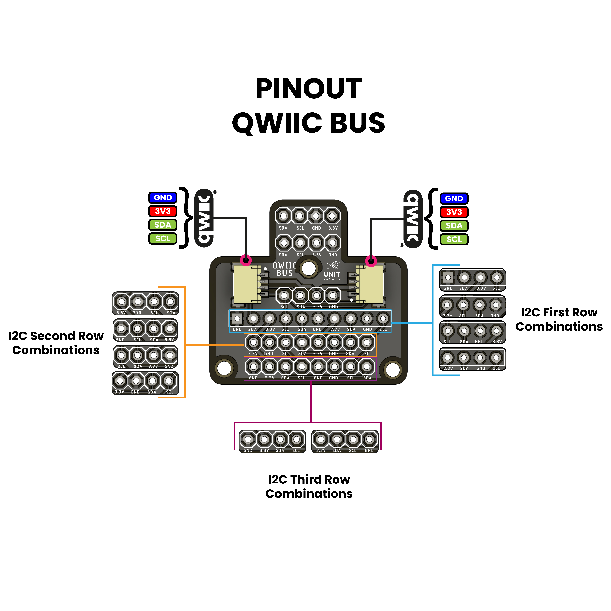

# Unit QWIIC BUS Module

## Description

The **Unit QWIIC BUS Module** is an **I2C expander** designed for **QWIIC bus compatibility**. It features **2.4mm output connections** and **two 1mm JST-SR connectors**, enabling the connection of up to **4 devices** on the same I2C bus. This module provides multiple connection positions, offering flexibility to accommodate various sensors and devices. You can select the optimal position based on your sensor's requirements.

> **Note:**  
> While the module supports connecting up to **4 devices** on the same I2C bus, the number of devices directly connected depends on the available space on the board. To connect all **4 devices**, an **external cable** is required.  
> For optimal layout and usability, it is recommended to connect up to **3 sensors** directly on the board.

    

> **Tip:**  
> The module is **expandable using external cables**. You can connect multiple modules to the same I2C bus to **increase the number of devices connected**.

## Features

- **2.4mm output connections**
- **2x 1mm JST-SR connectors**
- **Supports up to 4 devices on the same I2C bus**
- **Flexible positioning for compatibility with various sensors**
- **Expandable using external cables**

## Specifications

- **I2C Expander Module**
- **QWIIC Bus Compatible**
- **2.4mm Output Connections**
- **2x 1mm JST-SR Connectors**

## License

This project is licensed under the **GNU General Public License v3.0**.  
For more details, see the [LICENSE](./LICENSE) file or visit [GNU GPL v3.0](https://www.gnu.org/licenses/gpl-3.0.en.html).
